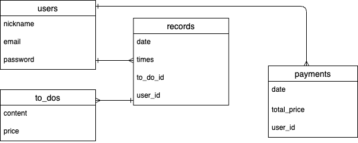
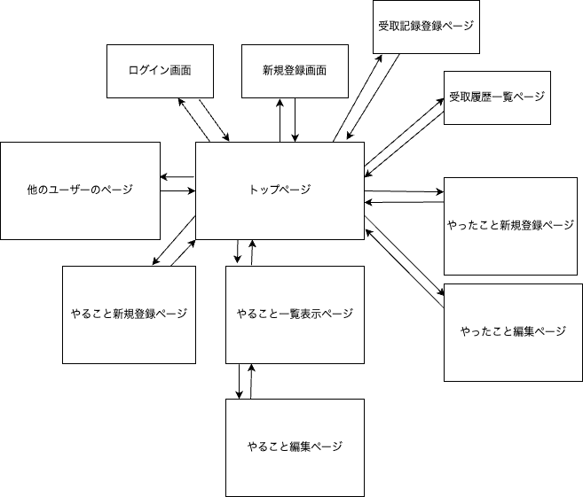

## アプリケーション名
kasego!  

## アプリケーションの概要
子供がおこづかいを管理するためのアプリです

## URL　https://kasego.onrender.com

### テスト用アカウント
Basic認証
* ID: admin1
* pass :1231

ログインユーザー
* hoge@hoge
* 111111  

トップ画面に全てのユーザー名が表示されます  
新規登録をする際は人が不快になるようなものや個人情報を含むものはお控えください

## 　利用方法

* 新規登録またはログインをする
* 「やることを登録」で内容の登録をすることができます
* 「やることリスト」で登録したやることを見たり編集することができます
* 「やったことを記録」でその日に実施したことを記録できます
* 「先月までの合計金額」でこれまでの月毎の合計金額を見ることができます
* みんなの記録の「ユーザー名」から各ユーザーの記録を見ることができます
* やったことはカレンダーの下に表示され、当日のみ修正と削除をすることができます

## このアプリケーションを作成した背景
我が家では子供が自分から進んで行動してくれるようになってもらいたいたくて、  
実施したことに応じておこづかいをあげることにしています。  
しかし、子供たちは実施したことを報告をするのをよく忘れてかなり遅れて報告してくるため、  
本当に実施したのか確認が出来ずおこづかいをあげられないことがよくありました。  
そういうことが積み重なっていくうちにめんどくさくなったのか、  
だんだん実施回数が減りこのおこづかい制度自体が意味をなさなくなってしまいました。  
そこで、簡単に記録ができるようにすれば報告を忘れることもなくなり、  
もっと頑張ってくれるのではないかと考えこのアプリケーションを作成しました。

## 実装した機能
### ユーザー管理機能  
新規登録とログインができます

### やること管理機能  

実施する内容と金額を登録できます  
登録したものを一覧で見ることができます  
登録内容を編集することができます  

### やったこと管理機能  
日付と実施したことと実施した回数を入力できます  
当日のみ修正と削除をすることができます  
他の人の記録を見ることができます  

### 受取記録管理機能  
月が変わると、前の月に実施した記録がある場合のみ受取記録登録画面へのリンクが表示されます  
受取記録を登録すると表示が消えます  
先月までの記録を一覧で見ることができます

## データベース設計

## 画面遷移図

## 開発環境
* フロントエンド HTML/CSS  
* バックエンド   ruby, rails  
* インフラ      postgresql

## 工夫したポイント
* 子供用なのでエラーメセージを日本語にしました
* 1日の合計金額、月の合計金額、その月にやったことをトップ画面で確認できるようにしました
* 前の月のおこづかいを受け取り済みかどうかを一目でわかるように設定しました

## 課題
* 開発環境のタイムゾーンをtokyoに設定していますが、本番環境ではutcになってしまっています。  
* 理解が浅い状態で作成したので、パフォーマンスがとても低くなってしまっています。

## テーブル設計

### usersテーブル

|Column   |Type   |Option      |
|---------|-------|------------|
|nickname |string |null: false |
|email    |string |null: false |
|password |string |null: false |

#### Association

- has_many :records 
- has_many :payments

### to_dosテーブル

|Column   |Type    |Option                   |
|---------|--------|-------------------------|
|content  |string  |null: false, unique:true |
|price    |integer |null: false              |

#### Association

- has_many :to_dos

### recordテーブル

|Column   |Type       |Option                         |
|---------|-----------|-------------------------------|
|date     |date       |null: false                    |
|times    |integer    |null: false                    |
|to_do_id |references |null: false                    |
|user-id  |references |null: false, foreign_key: true |

#### Association
- belongs_to :user
- belongs_to :to_do

### paymentsテーブル

|Column      |Type       |Option                         |
|------------|-----------|-------------------------------|
|date        |date       |null: false                    |
|total_price |integer    |null: false                    |
|user_id     |references |null: false, foreign_key: true |

#### Association
- belongs_to :user